## Metadata

| Field | Value |
|---|---|
| Project | ARCHANGEL — The Intelligence Layer for Fire TV |
| Repository | `Barnona/archangel` |
| Log file | `docs/FRICTION_LOG.md` |
| Started | 2026-09 (development history captured from the project work) |
| Log updated | 2026-10-10 (IST) |
| Platform | Fire OS / Android TV emulator / React Native TV |
| Primary development environment | Windows 11, PowerShell, Android Studio, Node.js, npm, ADB |
| Current product direction | Fire TV intelligence/discovery layer |
| Current modules | Home, App Discovery, App Details, Pulse, AdLens, Request Network, Profile |
| Current major data constraint | Curated verified catalog; no claimed Amazon Appstore-wide catalog API |
| Purpose of this log | Record user/developer friction, expected vs actual behaviour, root cause, resolution, evidence, and effort |

---

# 1. What ARCHANGEL is trying to achieve

ARCHANGEL is being developed as an **intelligence layer for Fire TV** rather than as another content-streaming application.

The intended loop is:

`Viewer → ARCHANGEL → discovery / diagnostics / requests → developer signal → better Fire TV ecosystem`

The main product areas are:

1. **App Discovery Intelligence** — search, understand intent, compare applications, identify missing apps and alternatives.
2. **AdLens** — explain observable app monetization and advertising signals without claiming system-level ad-control privileges.
3. **Pulse** — diagnose network and TV experience issues.
4. **Request Network** — let viewers request missing applications and aggregate demand.
5. **Concierge AI** — natural-language assistance across the ARCHANGEL experience.
6. **Future Amazon integrations** — official APIs/capabilities requested from Amazon where ARCHANGEL cannot legitimately access the required platform data or entitlement system.

A core design principle is:

> **When the platform does not expose a capability, ARCHANGEL should expose the limitation clearly and request an official integration rather than bypassing the platform.**

---

# 2. Friction log

| Timestamp / period | Area | Expected | What actually happened | Friction | Evidence | How it was solved | Time taken to solve |
|---|---|---|---|---|---|---|---|
| 2026-09-28 7:23 AM (IST) | Android/React Native TV setup | Fire TV React Native project should build on Windows | Native Android/TV project required additional configuration and compatibility work | Fire TV/TV React Native setup is more constrained than ordinary Android React Native | | Generated a standard RN Android project, adapted it for `react-native-tvos`, added TV manifest declarations, banner, launcher configuration and Fire TV-specific setup | 25 minutes |
| 2026-09-28 7:25 PM (IST) | Android emulator | `adb` and `emulator` commands should be available | ADB was available but `emulator` was initially not on PATH | Android SDK command-line tools were only partially available from PowerShell | `emulator: The term 'emulator' is not recognized as a name of a cmdlet, function, script file, or executable program. Check the spelling of the name, or if a path was included, verify that the path is correct and try again.` | Corrected Android SDK/emulator PATH configuration and created/started an Android 12 API 31 x86_64 AVD | 10 minutes |
| 2026-09-28 7:40 PM (IST) | Java / Gradle | Gradle should build with installed Java | Java 25 caused an incompatible class-file/major-version failure | Android/Gradle toolchain was using a newer JDK than the project supported | `Starting a Gradle Daemon (subsequent builds will be faster) FAILURE: Build failed with an exception. What went wrong: BUG! exception in phase 'semantic analysis' in source unit 'BuildScript' Unsupported class file major version 69` | Located Adoptium JDK 17 and configured Gradle/Java environment to use it | 20 minutes |
| 2026-09-28 7:52 PM (IST) | Native build | Debug APK should build | First full native build took a long time but eventually succeeded | Large React Native/Gradle dependency graph and native compilation | `BUILD SUCCESSFUL in 1h 27m 27s 58 actionable tasks: 58 executed` | Completed `app:assembleDebug`; successful build produced the debug APK | 1h 27m 27s |
| 2026-09-28 9:07 PM (IST)| App launch | Installed APK should start ARCHANGEL | App launched but initially required the development JavaScript bundle | React Native TV app was not using a packaged JS bundle during development | 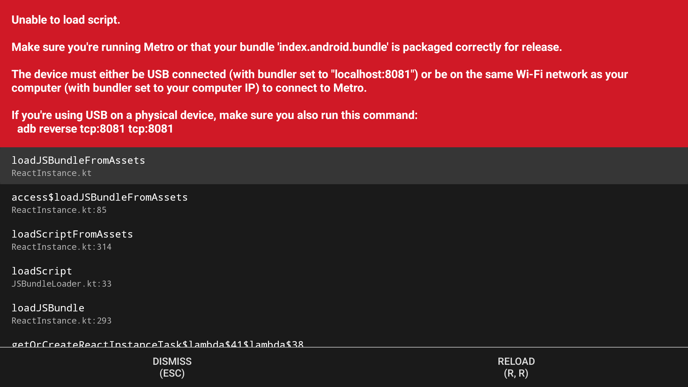 | Started Metro, verified port 8081, used ADB reverse for the emulator, and relaunched the application | 1 hour |
| 2026-09-29 7:33 AM (IST) | Backend | `npm run api` should start the API | Backend failed because `express` was missing | Backend dependency installation was incomplete |  | Restored backend dependencies and added the required Express package to the backend dependency set | 20 minutes |
| 2026-09-29 8:02 PM (IST) | Backend | API should start once | Server had duplicate `app.listen` behaviour | Duplicate server-start code caused backend startup problems | `app.listen(PORT, HOST, () => { app.listen(PORT, HOST, () => {` | Removed duplicate listener; server now listens once on port 4000 | 3 minutes |
| 2026-09-29 8:20 PM (IST) | App Details | Selecting an app should load its details | App Details initially failed against the API | Frontend/backend response contract did not yet match the expected detail structure | 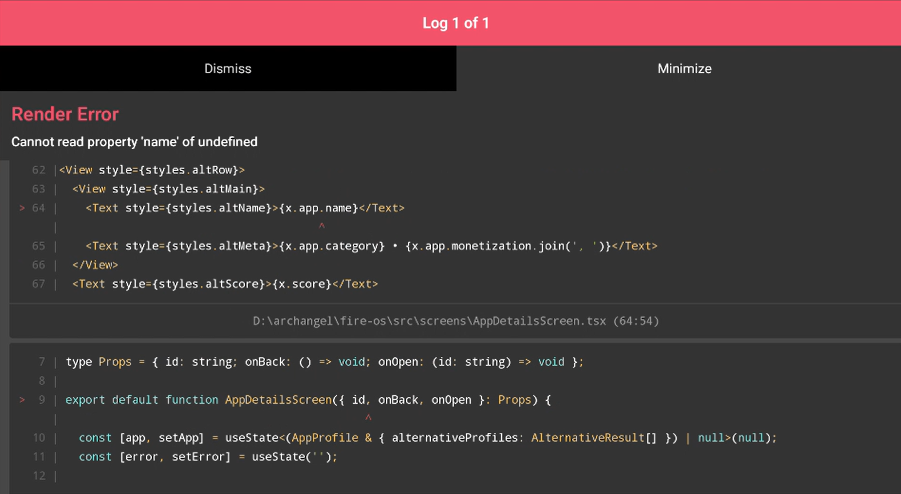 | Corrected the App Details backend response and frontend handling | 47 minutes |
| 2026-10-01 7:56 PM (IST) | Request Network | Submitting an app request should create a valid request | Generic request handling initially failed for some input paths | Request input normalization/validation was incomplete | 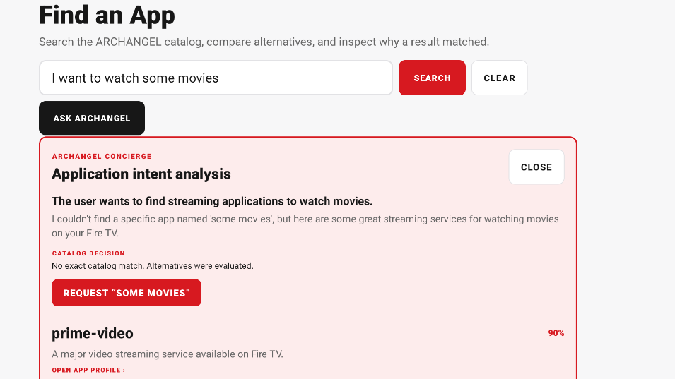 | Normalized request parsing and fixed the generic request path | 52 minutes |
| 2026-10-01 9:01 PM (IST) | Home TV navigation | Moving focus to lower Home options should scroll the screen | Lower options could receive focus without the page moving sufficiently | TV focus navigation and ordinary mobile-style layout were not enough for the full Home content | 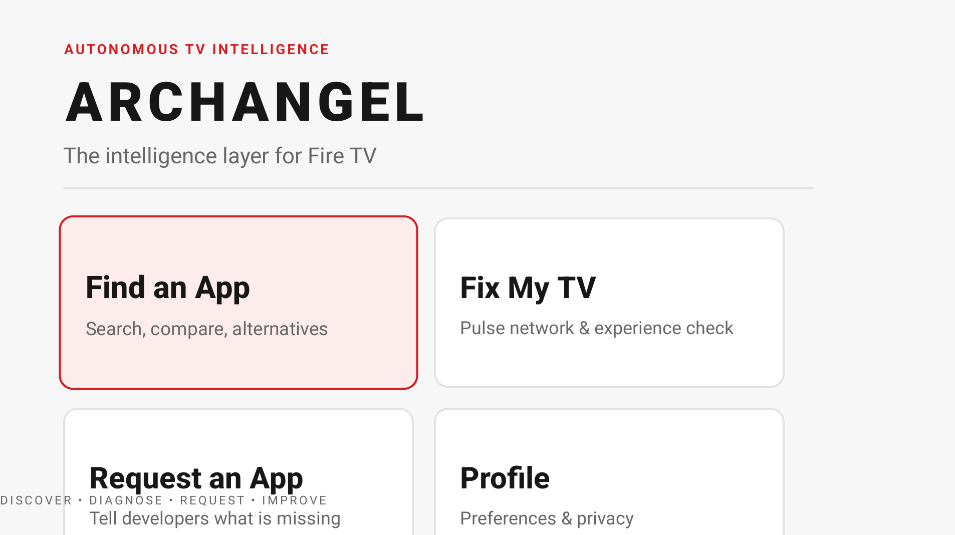 | Converted Home to a focus-aware `ScrollView` with `scrollsChildToFocus`; kept the footer inside scrollable content | 17 minutes |
| 2026-10-02 7:16 AM (IST) | AdLens | AdLens should appear as a real Fire TV module | Initial AdLens implementation only existed as the basic module/screen | No app-level evidence/detail flow yet | 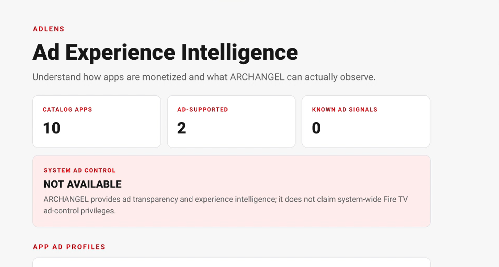 | Added AdLens to Home and implemented the first profile list and system-ad boundary messaging | 1 day |
| 2026-10-03 7:05 AM (IST) | Discover TV focus | SEARCH / ASK ARCHANGEL / REQUEST APP should become black when focused | React Native TV `Pressable` focus styling did not reliably produce the requested visual state | TV focus state was not behaving consistently through the style callback | | Replaced implicit focus styling with explicit `onFocus` / `onBlur` React state | 34 minutes |
| 2026-10-03 7:37 PM (IST) | Discover TV focus | Final focused buttons should have black background and readable text | Earlier implementation changed the background but visual result still did not match | Focus styling was being applied inconsistently | | Added explicit focus state and consolidated the button styles; later removed duplicate `requestFocused` state | 23 minutes |
| 2026-10-03 8:18 PM (IST) | Git synchronization | Local project should pull the latest GitHub changes | `git pull` aborted because local `DiscoverScreen.tsx` changes would be overwritten | Local working tree differed from remote | `error: Your local changes to the following files would be overwritten by merge: fire-os/src/screens/DiscoverScreen.tsx Please commit your changes or stash them before you merge. Aborting Updating files: 100% (33/33), done. Merge with strategy ort failed.` | Identified the conflicting file; recommended preserving or restoring the local change before pulling instead of using `git reset --hard` | 14 minutes |
| 2026-10-03 8:33 PM (IST) | AdLens detail | Selecting an AdLens profile should open an app-specific detail page | Emulator showed `Cannot GET /adlens/prime-video` | Frontend had been updated before the running backend process had loaded the new Express route | 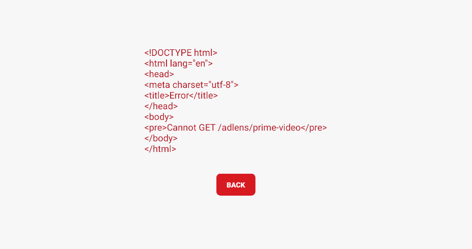 | Added/verified `GET /adlens/:appId`, API client method, navigation state and detail screen; backend must be restarted after route changes | 15 minutes |
| 2026-10-03 8:56 PM (IST) | AdLens detail navigation | AdLens profile cards should be selectable with the TV remote | Profiles were initially informational/non-focusable | TV application needs explicit focus targets |  | Converted profile cards to focusable `Pressable` controls and connected them to the detail route | 5 minutes |
| 2026-10-03 9:04 PM (IST) | AdLens Back control | Focused `← ADLENS` button should have black background with readable white text | Background changed to black but the text remained black | Focused text color was not tied to the same explicit TV focus state | 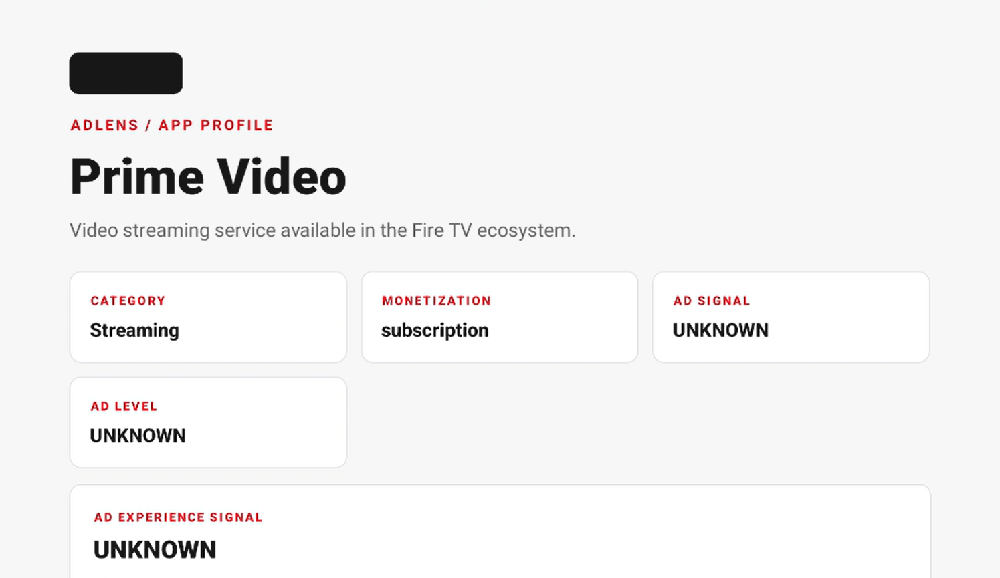 | Added explicit back-button focus state using `onFocus` / `onBlur` and switched focused text to white | 7 minutes |
| 2026-10-03 9:12 PM (IST) | AdLens filtering | Users should be able to inspect advertising states without an arbitrary score | All profiles were shown together | Evidence states needed a clearer way to inspect the catalog | 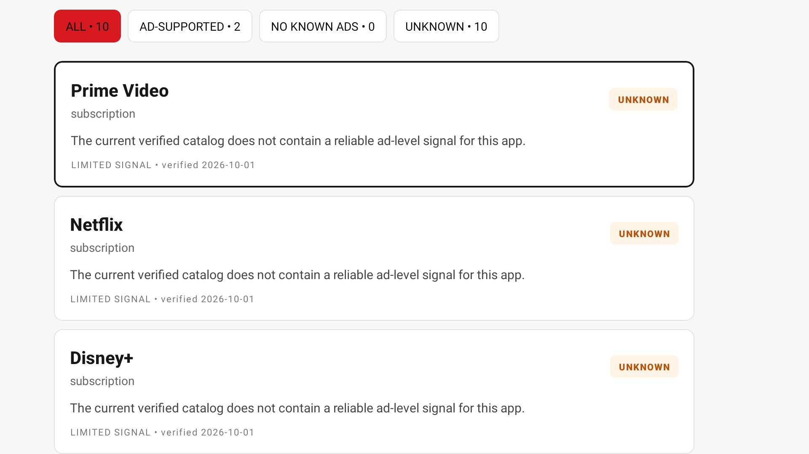 | Added filters: ALL, AD-SUPPORTED, NO KNOWN ADS, UNKNOWN | 20 minutes |
| 2026-10-03 9:12 PM (IST) | AdLens filter focus | Focused filter should remain readable | Focused filter could become dark-on-dark depending on active/focused combination | Focus and selection were two separate visual states | 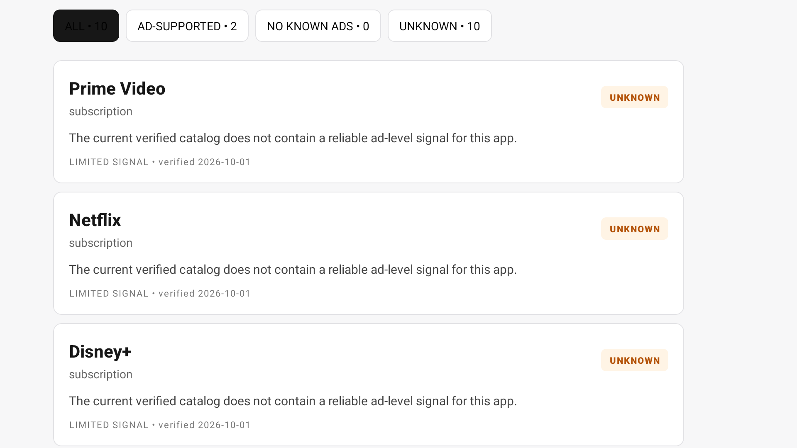 | Added focused text contrast handling | 20 minutes |
| 2026-10-03 9:33 PM (IST) | AdLens subscriptions | Subscription-based apps should expose relevant monetization context | Subscription was only represented as a monetization field | A subscription does not necessarily mean an ad-free tier | 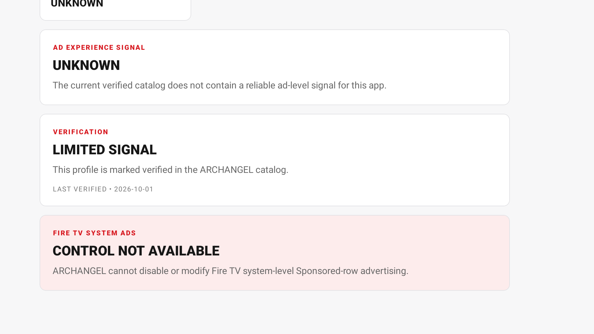 | Added a **SUBSCRIPTION SIGNAL** section explicitly stating that ARCHANGEL does not currently verify whether a subscription tier removes advertising | 25 minutes |
| 2026-10-04 11:58 AM (IST) | AdLens detail | Add AdLens evidence panel | Showing generated detail of evidence and verification and why this signal? | This separates what ARCHANGEL knows from how ARCHANGEL interprets the signal | 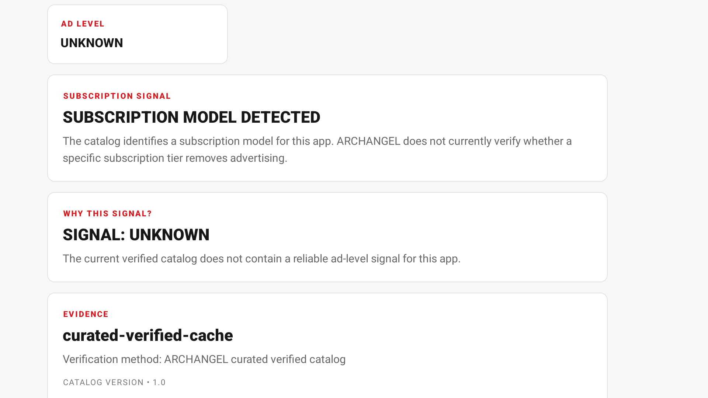 | Added a panel for `curated-verified-cache` | 11 minutes |
| 2026-10-04 12:10 PM (IST) | AdLens verification date | Verification metadata should reflect the current catalog verification cycle | Existing profiles still displayed 2026-10-01 after the verification cycle was moved to 2026-10-04 | Catalog lastVerified values were stale relative to the new verification date | 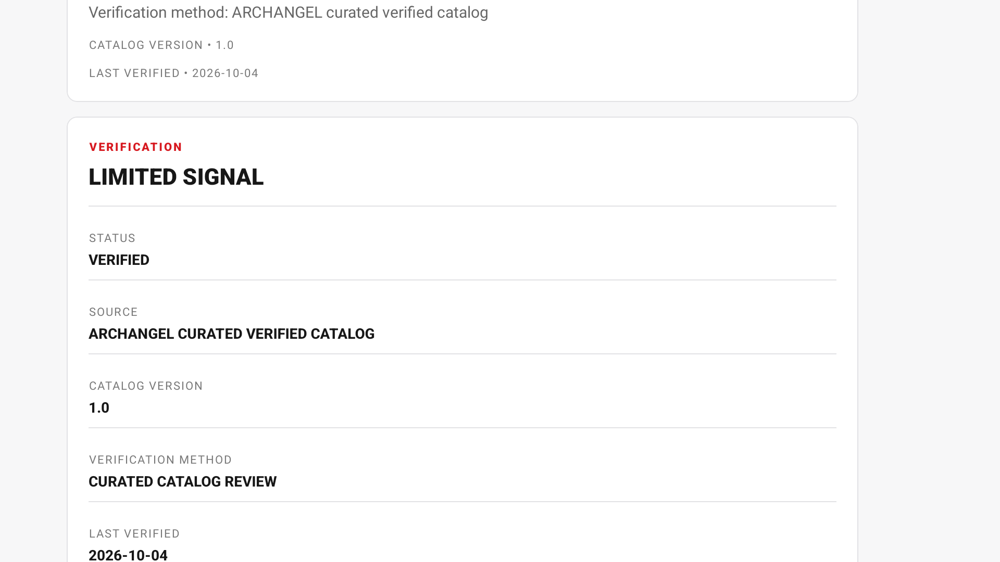 | Updated all catalog lastVerified values from 2026-10-01 to 2026-10-04; AdLens evidence now reports the updated date | 3 minutes |
| 2026-10-04 2:40 PM (IST) | ARCHANGEL Metro / Android TV runtime | Existing debug APK should load its JavaScript bundle from the running Metro server | App initially showed "Unable to load script" even though Metro was running | Root cause investigation established that the development runtime needed Metro connectivity verification; Metro itself was healthy, ADB reverse was active, the emulator was connected, and the APK was confirmed debuggable. The app recovered after restarting/relaunching the development runtime | 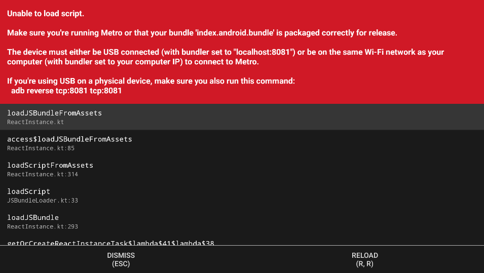 | Restarted Metro/app development runtime and verified the emulator-to-Metro path; ARCHANGEL loaded successfully again | 20 minutes |
| 2026-10-04 3:10 PM (IST) | AdLens Subscription Intelligence | Subscription apps should expose monetization context without implying that a subscription is automatically ad-free | The first UI only showed a generic subscription signal and could not distinguish a detected subscription model from verified ad-free-tier information | Subscription model data alone is insufficient evidence for an ad-free claim; the current catalog has no authoritative subscription-offer or entitlement source |  | Added explicit SubscriptionIntelligence fields for model, ad-free tier status, offer status, verification and evidence; exposed them through the backend and replaced the generic UI signal with a structured Subscription Intelligence panel | 12 minutes |
| 2026-10-04 3:25 PM (IST) | AdLens Subscription Intelligence filtering & presentation | Users should be able to inspect subscription-based apps directly from the main AdLens screen and distinguish subscription status from ad-free verification | Subscription intelligence existed only inside individual app detail pages, requiring users to open profiles one by one | The overview exposed advertising-state filters but had no subscription-oriented navigation, summary metric, or visible distinction between subscription and ad-free verification | 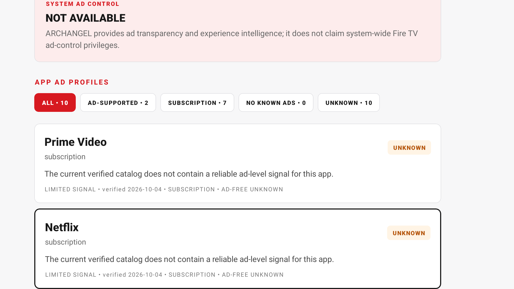 | Added a SUBSCRIPTION APPS metric, SUBSCRIPTION filter, and subscription/ad-free status indicators to AdLens profile rows; preserved UNKNOWN when no authoritative ad-free evidence exists | 8 minutes |
| 2026-10-04 7:30 PM (IST) | AdLens historical monetization intelligence | Current AdLens state should remain distinguishable from historical evidence and change tracking | There was no persistent snapshot model or timeline, so ARCHANGEL could show the current signal but not explain what changed over time | Historical claims require stored snapshots; catalog changes must not be presented as app monetization changes without evidence | 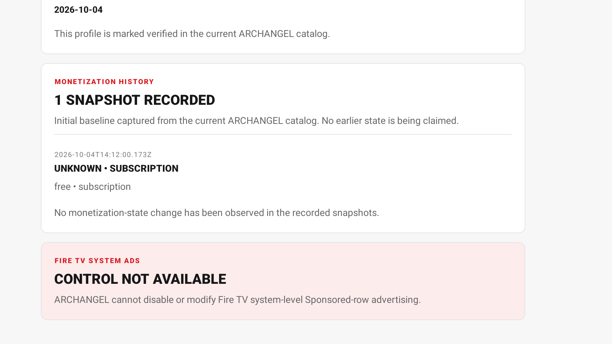 | Added persistent monetization snapshots, change detection labelled as DATA SIGNAL CHANGED, a history API, and an initial-baseline timeline that does not fabricate prior history | 5 minutes |
| 2026-10-04 7:45 PM (IST) | AdLens summary-card layout | Four overview metrics should remain fully visible within the TV viewport | Fixed-width metric cards caused the right-side cards to be cut off | Four 245px cards plus margins exceeded the available content width on the target TV viewport | 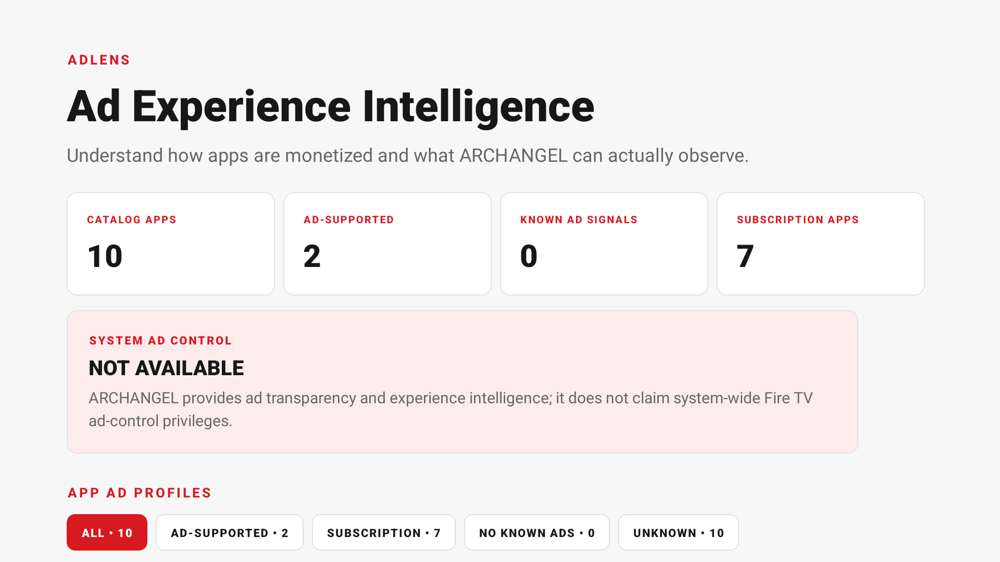 | Changed the metric row to use responsive equal-width cards with constrained text and reduced inter-card spacing | 3 minutes |
| 2026-10-04 8:00 PM (IST) | AdLens automated evidence refresh | History should be generated by a verification lifecycle rather than by opening a read-only screen | History capture was coupled to `/adlens` and history reads, making a GET request mutate persistent data | Read endpoints should not create historical records; refresh needs explicit lifecycle semantics | | Added startup refresh, configurable scheduled refresh, manual `POST /adlens/refresh`, read-only history endpoints, refresh statistics, and environment configuration | 4 minutes |
| 2026-10-04 9:12 PM (IST) | App Request Network- request normalization | Equivalent requests should contribute to one demand signal | Variants such as different capitalization, punctuation, or an "app" suffix could otherwise be treated as separate request identities | Demand aggregation needed a canonical request key while preserving the user's original display name | | Added normalized request identity, duplicate detection metadata, and separate discovery/manual demand counts | 7 minutes |
| 2026-10-05 9:46 AM (IST) | Request screen runtime regression | The new missing-app request context should render without breaking the Request screen | React Native reported `Property 'source' doesn't exist` because the component type declared `source` but the function did not destructure it | The new request-source prop was wired through navigation/API but omitted from the RequestScreen function parameters | 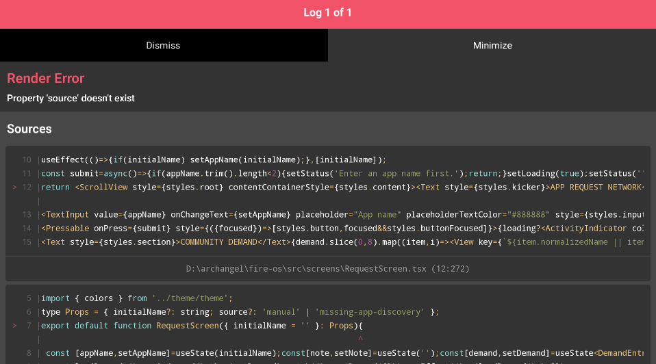 | Destructured `source` with a `manual` default in RequestScreen; verified the missing-app flow could use `missing-app-discovery` | 5 minutes |
| 2026-10-05 8:09 PM (IST) | App Request Network — duplicate-aware submission & demand intelligence | Existing demand should be visible when users request an already-demanded app, and developers should receive a ranked demand signal rather than raw request rows | A normalized request identity existed, but submission feedback and demand ranking were still basic | The system needed to distinguish first demand from existing demand and weight total, discovery-origin, and recent requests | 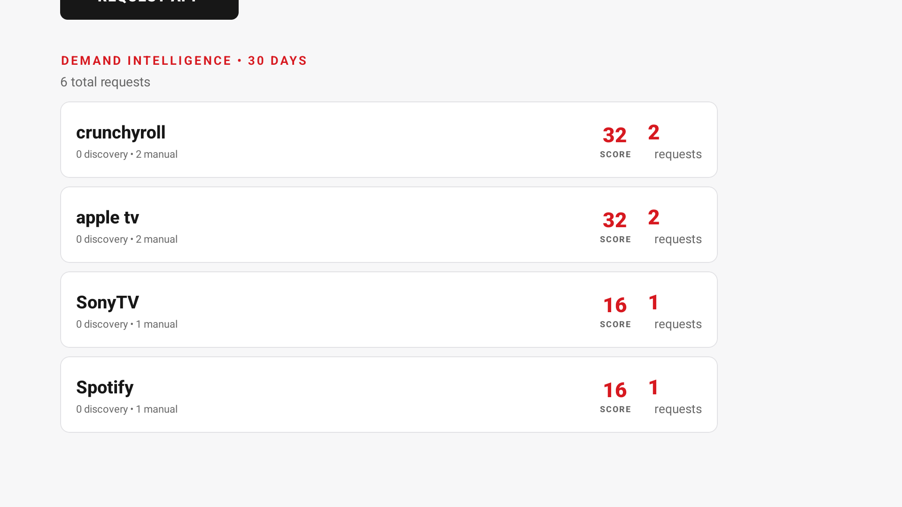 | Added duplicate-aware submission feedback, demand scoring, 30-day recency, discovery/manual breakdown, and ranked top-demand results | 2 hours |
| 2026-10-07 9:15 AM (IST) | Request Network — Developer Opportunity | Demand rankings should help developers identify which missing apps represent the strongest opportunities | Demand Intelligence showed request volume and momentum, but there was no dedicated opportunity signal for prioritising developer action | Developers need a concise opportunity view that combines recency, momentum and discovery-driven demand rather than relying on raw request counts | 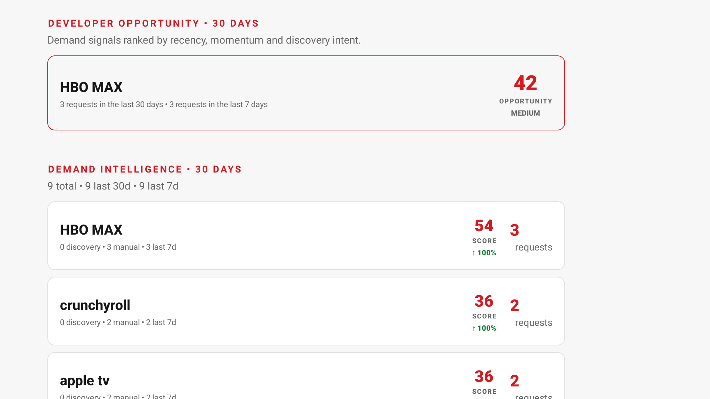 | Added deterministic opportunity scoring, HIGH/MEDIUM/EMERGING opportunity tiers, opportunity reasons, equal-window trend comparison, and a dedicated Developer Opportunity UI in the Request Network | 10 minutes |
| 2026-10-08 10:52 AM (IST) | AI Intelligence Layer with Amazon Bedrock | Bedrock should act as ARCHANGEL's primary reasoning layer for App Discovery | Bedrock returned `Operation not allowed`; model availability showed agreement, entitlement and region available but `authorizationStatus: NOT_AUTHORIZED`. Initial diagnostic CLI checks also lacked IAM permissions for availability/list operations, while ARCHANGEL correctly fell back to Gemini | Bedrock availability output: `authorizationStatus: NOT_AUTHORIZED`; App Discovery response showed `provider: gemini`, `fallbackUsed: True`, `fallbackReason: Operation not allowed` |  | Verified AWS CLI/IAM identity, added the required diagnostic Bedrock permissions, confirmed the remaining blocker is Bedrock authorization/account verification rather than request formatting, and retained Gemini fallback |  |
| 2026-10-08 7:56 PM (IST) | Android TV emulator / ADB | The existing `Television_1080p` emulator should remain reachable through ADB for ARCHANGEL testing | `emulator-5554` became `offline`; restarting the ADB server did not recover it, and starting another instance of the same AVD failed because multiple instances of the same AVD are not enabled by default | `adb.exe: device offline`; emulator reported `FATAL: Running multiple emulators with the same AVD is an experimental feature` |  | Reset ADB, avoided launching a duplicate AVD, and moved to a clean emulator restart/cold-boot path | 1 hours |
| 2026-10-08 9:30 PM (IST) | Pulse / Fix My TV diagnostic dashboard | Pulse should provide a live backend health overview for API, catalog integrity, Request Network, AdLens evidence and AI provider status, with useful metrics and a full-check action | The existing Pulse foundation did not yet provide the complete diagnostics dashboard or connect the screen to a dedicated health endpoint | Backend `/pulse` endpoint and Pulse screen/API | 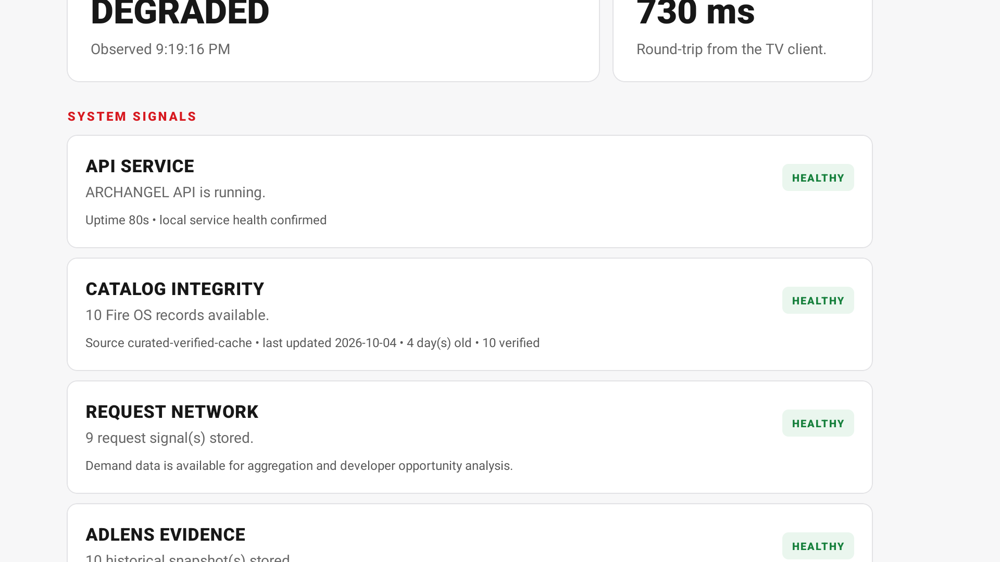 | Added shared `PulseStatus`/`PulseCheck` types, backend checks and metrics, a typed API client method, and a light/red Pulse dashboard with `RUN FULL CHECK` | 13 minutes |
| 2026-10-09 7:51 AM (IST) | AdLens evidence intelligence | AdLens should communicate not only monetization values, but also how well each value is supported by the available evidence | Existing profiles exposed source and verification metadata, but lacked a structured status per signal and a concise completeness summary across advertising, subscription, ad-free tier and monetization |  |  | Added `EvidenceStatus`, confidence metadata, an `AdLensEvidenceSummary` type, backend evidence classification and a four-signal completeness percentage. UI/API runtime verification remains pending; classifications must not imply authoritative verification where the curated catalog is the only source | 10 minutes |
| 2026-10-09 8:25 PM (IST) | AdLens UI / Evidence Completeness | Users should see how much of each app's monetization profile is supported by available signals without confusing completeness with certainty | The backend evidence model existed, and AdLens cards displays a summary or visual indicator | User can see the evidence completeness | 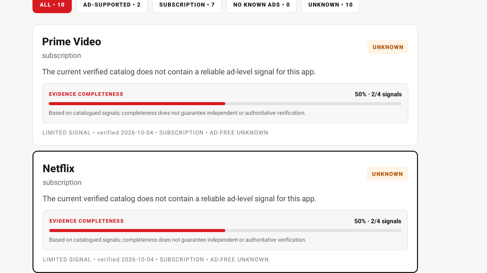 | Added Evidence Completeness percentage, supported/total signal count, red progress indicator and a caveat explaining that completeness does not guarantee independent or authoritative verification. User confirmed the change is working | 26 minutes |
| 2026-10-09 9:15 PM (IST) | AdLens UI / Signal-level transparency | Users should be able to inspect the evidence status behind each monetization signal, not just an aggregate completeness percentage | Evidence Completeness was visible, but individual advertising, subscription, ad-free-tier and monetization statuses were not shown on the app card |  | 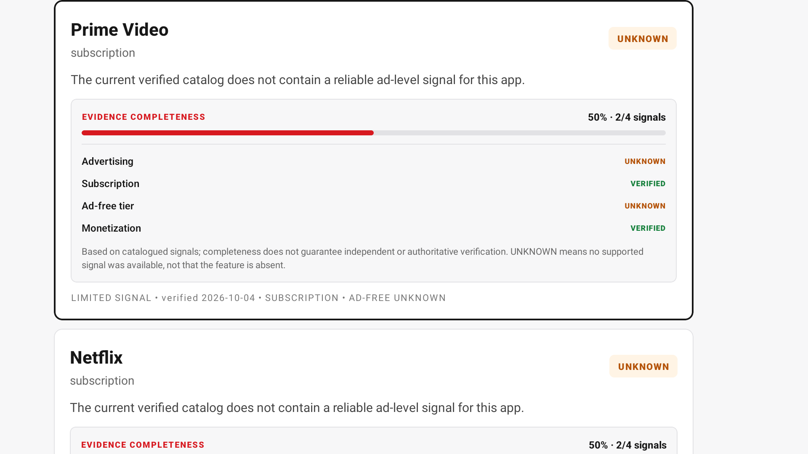 | Added per-signal status rows with distinct visual treatments and an explanatory note that UNKNOWN means no supported signal was available, not that the feature is absent. User confirmed the change is working | 10 minutes |
| 2026-10-09 10:05 PM (IST) | App Details / Monetization History runtime crash | Opening any app's details should render its recorded monetization history, including older or partial snapshots | Render error: `Cannot read property 'replace' of undefined` while rendering the history timeline | User screenshot of the React Native render error on `AppDetailsScreen.tsx` line 68 | Missing history fields were assumed to always exist; older/incomplete snapshots can omit `evidence.status`, confidence or monetization data | Added defensive defaults for evidence status, confidence, monetization arrays and changed-field labels. User confirmed App Details now works | 15 minutes |
| 2026-10-09 (IST) | ARCHANGEL UI / History alignment and cross-screen icons | Monetization History cards should align cleanly, and the app should use visual symbols to reduce text-heavy navigation across screens | An extra red dot appeared outside the history card, the card alignment was offset, and Home, Discover, AdLens, Pulse, Request Network and Profile relied heavily on text labels | showing the extra timeline dot and misaligned history card |  | Removed the external timeline rail/dot, made snapshot cards fill the timeline container, retained the latest marker inside the card, and added lightweight symbols to Home navigation and key headings/actions across the main screens. Runtime verification is pending | 5 minutes |
| 2026-10-10 8:02 AM (IST) | Stabilization / Backend integration smoke tests | Core backend routes should respond with consistent, correctly shaped data across Discovery, AdLens, Pulse and Request Network | All nine automated read-only integration smoke checks passed against the running local API | No blocking backend integration failure found in the initial smoke pass; emulator regression testing remains separate | Terminal output showing nine `PASS` checks and `9 integration smoke checks passed` | Added a repeatable `backend/smoke-test.js` suite and `test:smoke` npm script; verified health, catalog, categories, app profiles, discovery, AdLens boundaries/history metadata, Pulse and demand aggregation. User ran the suite and confirmed all nine checks passed | 10 minutes |
| 2026-10-10 9:15 AM (IST) | Sideload Sentinel / Initial feature implementation | ARCHANGEL needs a safe package-readiness feature without claiming privileged Fire TV access or bypassing platform protections | Added a TV-friendly metadata review screen with package ID format, min/target SDK, package-size checks and explicit limitations | No APK parsing, malware scan, signature verification, installation or live device compatibility claim; emulator validation remains pending | 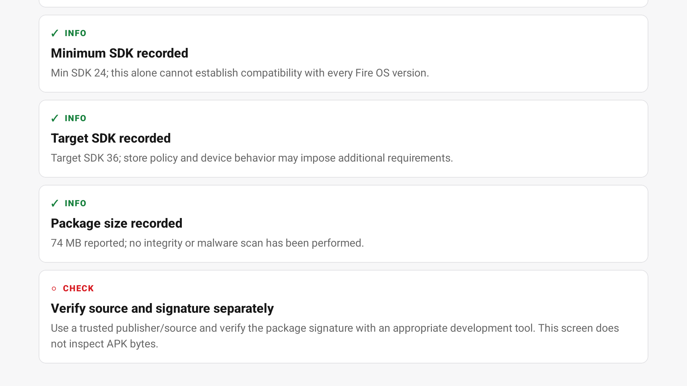 | Added the initial Sideload Sentinel screen and wired it into Home/navigation. Results are preliminary metadata checks only; the UI explicitly states that it does not inspect APK bytes or guarantee installation/safety | 20 minutes |
| 2026-10-10  (IST) | App Discovery / Focused result-card styling | Focused search results should use the established light-red selection style | Result card switched to a solid black background with white text | New visual treatment conflicted with the preferred light/red design and reduced consistency with the rest of the interface | 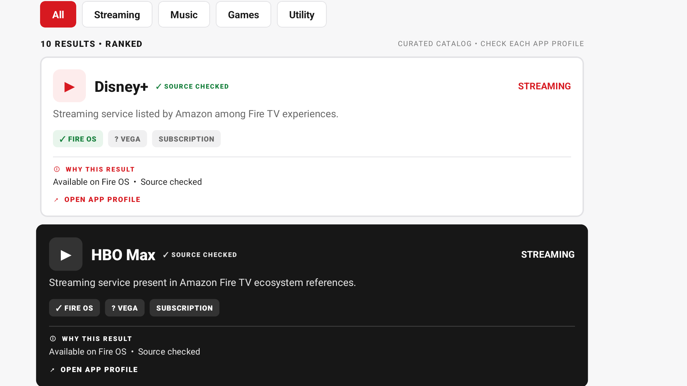 | Restored pale-red focused background, red border, dark text and light icon/badge surfaces; runtime verification remains pending | 5 minutes |
| 2026-10-10 12:34 PM (IST) | Sideload Sentinel / APK selection on Android TV | The “SELECT APK & INSPECT” action should open a local file browser so a user can choose an APK and inspect its manifest metadata | The Android 12 TV emulator displayed “You don't have an app that can do this.” Queries for both `ACTION_OPEN_DOCUMENT` and `ACTION_GET_CONTENT` returned no activities; the emulator had no document-picker provider | The picker intent depended on a system document provider that was absent from this emulator. Changing the MIME type did not help. Direct access to shared Downloads would also introduce scoped-storage constraints | ADB output: `No activities found` for both picker actions; `/sdcard/Download/archangel-test.apk` was successfully staged for testing | Replaced the external picker dependency with a TV-friendly in-app APK browser backed by ARCHANGEL's app-specific Downloads/import folder. Added local APK listing and manifest inspection through Android `PackageManager`, filename/size display, refresh, and remote-selectable rows. No broad storage permission, installation, upload, or execution is required. User confirmed the flow is working | 30 minutes |
| 2026-10-10 2:56 PM (IST) | Sideload Sentinel / Completion validation | Users should be able to browse local APKs, review package metadata and declared permissions, see compatibility warnings and understand which security checks were actually performed | Initial unit-test compilation failed because `assertDoesNotThrow` was unavailable in the Kotlin/JUnit test setup | Gradle output: `Unresolved reference 'assertDoesNotThrow'` in `ApkContainerValidatorTest.kt` | 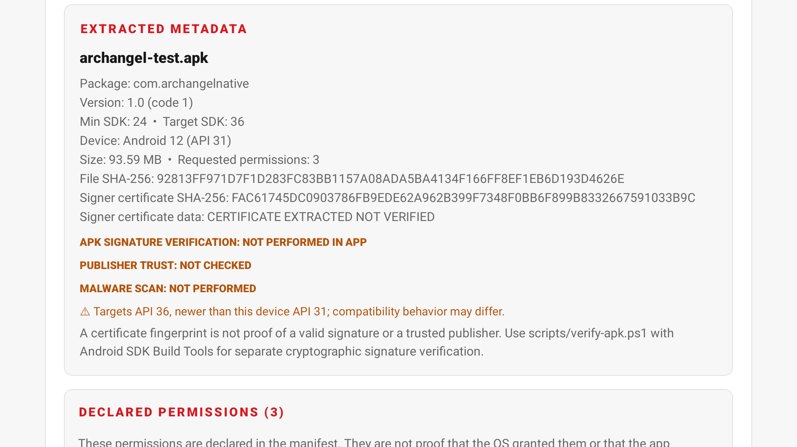 | Updated Sentinel permission explanations and separated APK signature verification, publisher trust and malware-scan status; hardened APK/ZIP container validation, documented malformed-input regression cases, and added a PowerShell `apksigner` verification helper | 50 minutes |

---

# 3. Important friction patterns

## 3.1 TV focus is a first-class engineering problem

Several UI problems came from treating Fire TV/Android TV focus like ordinary touch/mobile interaction.

Repeated issues:

- `Pressable` focus styles did not always render as expected.
- Focused controls needed explicit state.
- Focused text and focused background must be designed together.
- Scroll containers must cooperate with TV focus.
- Lower controls must remain visible when remote navigation reaches them.

**Decision:**

For important TV controls, prefer explicit:

`onFocus → state → focused style`

and

`onBlur → state → normal style`

rather than assuming mobile-style `Pressable` styling will always be sufficient.

---

## 3.2 Backend changes require process lifecycle awareness

The AdLens detail problem demonstrated:

> Code existing in GitHub does not mean the currently running backend process has loaded that code.

Example:

`/adlens/:appId` existed in the repository, but the emulator still received:

`Cannot GET /adlens/prime-video`

The actual resolution was to ensure the backend process was restarted after the route was introduced.

**Decision:**

For every backend route change:

1. Save code.
2. Restart API process.
3. Test endpoint directly.
4. Then test through the Fire TV UI.

---

## 3.3 ARCHANGEL must not invent platform capabilities

The catalog problem is a product-level friction rather than just a coding problem.

ARCHANGEL currently does **not** have an official Amazon-wide application catalog API.

Therefore the system uses:

`curated-verified-cache`

and explicitly exposes:

`amazonAppstoreApi.status = not_available`

This led to the documented feature request for the Amazon Appstore Catalog API.

The same principle now applies to subscriptions:

- ARCHANGEL can identify a subscription monetization signal.
- ARCHANGEL cannot currently claim that the subscription is ad-free.
- ARCHANGEL cannot claim arbitrary third-party subscription entitlement access.
- Future Amazon integration must be official and authenticated.

---

# 4. Current friction-to-feature evolution

A useful pattern from the project is that several friction points directly produced product improvements.

| Friction | Product/engineering improvement |
|---|---|
| Missing Amazon-wide catalog | Official Appstore Catalog API feature request |
| Missing app discovered by AI | Request Network integration |
| TV focus styling unreliable | Explicit TV focus-state architecture |
| Home lower options not visible | Focus-aware scrolling |
| Ad data incomplete | UNKNOWN signal instead of fabricated rating |
| Subscription does not imply ad-free | Explicit Subscription Signal |
| System ads cannot be controlled | Clear AdLens system-ad boundary |
| Detail route unavailable in running API | Backend route verification/restart workflow |
| Small static AdLens list | Focusable profiles + detail pages + filters |

---

# 5. Current state

### Completed

- Fire TV/Android TV React Native foundation
- Light/red ARCHANGEL visual system
- Home screen
- TV focusable navigation
- App Discovery
- AI App Discovery
- Missing-app detection
- Alternatives
- App Details
- Request Network
- Demand aggregation
- Pulse foundation
- AdLens overview
- AdLens app profiles
- AdLens detail pages
- AdLens filters
- Subscription signal
- Amazon Appstore API feature request
- MIT license
- Project architecture/documentation

### Active development

**AdLens**

Next planned increments:

1. Historical ad/monetization changes
2. Better profile filtering and focus navigation
3. Subscription Intelligence
4. Historical ad/monetization changes
5. Better profile filtering and focus navigation
6. Subscription Intelligence

### Future platform requests

1. **Amazon Appstore application catalog API**
2. **Amazon subscription / entitlement integration**, including official discovery of ad-free subscription options where exposed

---

# 6. Friction log operating rule

Every significant friction from this point onward should record:

`Timestamp → Expected → Actual → Friction → Evidence → Root cause → Solution → Time taken`

This log is intended to document not only bugs but also **product-discovery friction**: situations where the original assumptions about Fire TV, Amazon APIs, TV navigation, or user behaviour proved incorrect.

---

---

# 7. Sideload Sentinel hardening — 2026-10-10

| Field | Details |
|---|---|
| Timestamp | 2026-10-10 (IST) |
| Expected | Sentinel should reject malformed inputs, explain compatibility and declared-permission findings, identify exactly what its security checks do, and provide a real signature-verification path. |
| Actual before this change | The app extracted package metadata and a SHA-256 digest, but signer fingerprints were only extracted—not proof of a valid APK signature. Permissions were mostly raw names; invalid ZIPs had generic errors; the UI could be misread as a security verdict. |
| Friction | Metadata inspection, hashing, signing integrity, publisher trust, compatibility, and malware scanning are separate things, but the prototype did not make all of those boundaries equally explicit. |
| Evidence | `fire-os/android/app/src/main/java/com/archangelnative/ApkInspectorModule.kt`, `fire-os/src/lib/apkInspector.ts`, `fire-os/src/screens/SideloadSentinelScreen.tsx`, `scripts/verify-apk.ps1`, `docs/SIDELOAD_SENTINEL.md` |
| Root cause | Android `PackageManager` archive metadata exposes package/certificate information but is not a substitute for explicitly running the SDK signature verifier. A file SHA-256 is only a fingerprint unless compared with a separately trusted expected digest. |
| Solution | Added ZIP/manifest validation, clear empty/unreadable/oversized-file errors, explicit signature/integrity/malware scan status fields, SDK compatibility warnings, permission rationale labels, a Windows PowerShell wrapper around Android SDK `apksigner verify --verbose --print-certs`, optional trusted-hash comparison, a malformed-input validation matrix, and CI build/signature checks. |
| Result | Completed directly on `main`. Added APK container validation and malformed-input unit tests, local APK browsing and metadata inspection, SHA-256 and signer-certificate display, permission explanations, compatibility warnings, explicit boundaries for signature verification/publisher trust/malware scanning, and the `scripts/verify-apk.ps1` helper for `apksigner` verification and optional trusted-hash comparison. User confirmed `app:testDebugUnitTest app:assembleDebug` completed successfully after replacing the unsupported `assertDoesNotThrow` assertion. The user's earlier `apksigner` run also verified the debug APK's v2 signature. These checks do not constitute malware scanning or publisher trust verification. |
| Time taken | Not measured. |

### Regression cases to execute

1. Valid signed APK and known trusted hash.
2. Non-APK extension, random text renamed to `.apk`, empty file, ZIP without `AndroidManifest.xml`, invalid manifest, and truncated/corrupted APK.
3. Signature tampering and expected-SHA-256 mismatch with the desktop verifier.
4. Unreadable/missing file, compatibility warning display, empty permission list, and sensitive declared permissions.
5. Re-launch app after inspection; verify no installation, upload, or APK execution occurs.

---

# 8. App Discovery catalog validation — 2026-10-10

| Field | Details |
|---|---|
| Timestamp | 2026-10-10 (IST) |
| Expected | Catalog records should be structurally consistent, alternative links should resolve, and stale verification dates should be visible rather than silently treated as fresh. |
| Actual before this change | The curated catalog was consumed directly by discovery and detail routes; there was no standalone validation command or regression suite for catalog schema and cross-record references. |
| Friction | A malformed record or broken alternative ID could quietly degrade discovery, while old verification dates could be mistaken for current evidence. |
| Evidence | `shared/src/catalog.seed.json`, `backend/catalog-validation.js`, `backend/catalog-validation.test.js` |
| Root cause | Catalog ingestion was deliberately a curated static cache, but the data contract was not enforced by a repeatable validator. |
| Solution | Added a validator for required fields, ID format/uniqueness, platform and monetization values, ad-level values, verification dates, alternative references, and verification age. Stale verification is a warning; structural/data-integrity errors fail validation. Added Node test cases and npm scripts `test:catalog` and `validate:catalog`. |
| Result | Implemented directly on `main`. The current 10-record catalog was statically inspected and had no duplicate IDs, malformed required fields, or broken alternative references. The new automated tests and command have not yet been run in the user's local environment. |
| Time taken | Not measured. |

## Last updated

**2026-10-10 — Catalog validation tooling added; local test execution pending**
